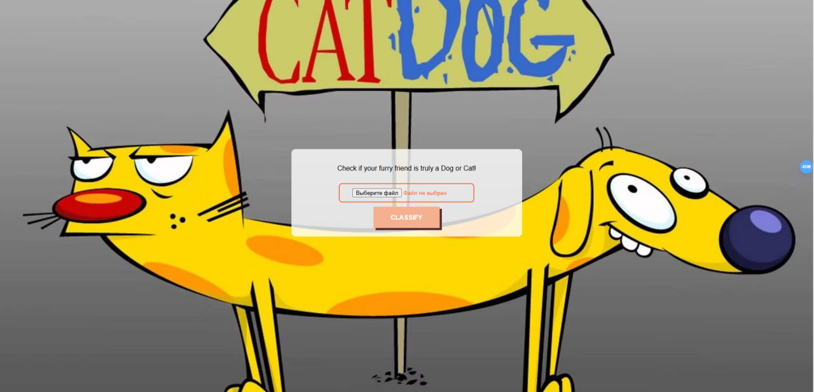
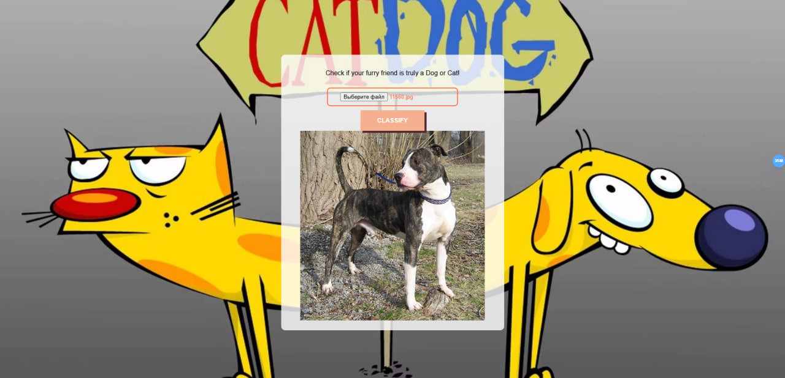
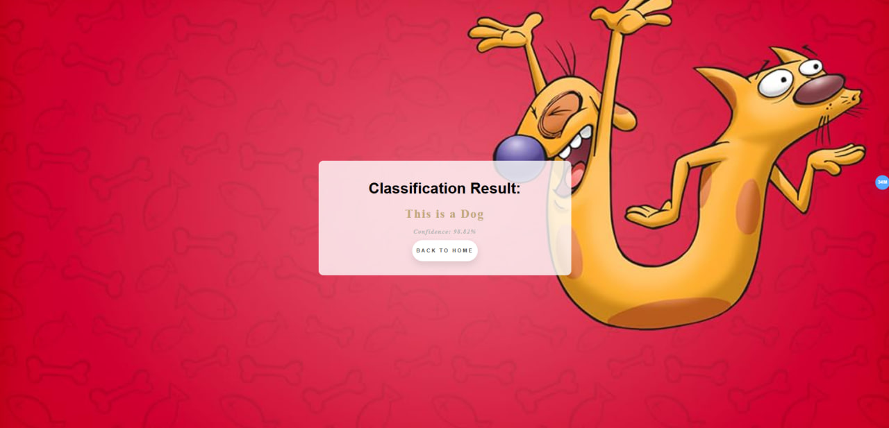

# CatDog Classifier

This Flask web application allows users to upload an image of a cat or a dog and receive a classification result.

## Dataset
For this project, I chose the [Cat vs Dog dataset](https://www.kaggle.com/datasets/unmoved/30k-cats-and-dogs-150x150-greyscale) from Kaggle. This dataset contains thousands of images of cats and dogs.

## Google Colab
I used Google Colab to train and evaluate the model. You can access the Colab notebook [here](https://colab.research.google.com/drive/1GokwPul7LKFvvcVFHfyCo33TgFk-QsHE?usp=sharing).

## Steps to Complete the Task
1. **Choose Dataset**: I selected the Cat vs Dog dataset from Kaggle.
2. **Prepare Data for Training**: I removed unnecessary fields, labeled each image, and preprocessed the images.
3. **Train & Evaluate Model**: I trained and evaluated the model using Google Colab.
4. **Download Model Locally**: After training, I downloaded the model locally.
5. **Create Flask Classifier App**: I created a Flask web application with two pages - one for uploading images and one for displaying prediction results.

## Project Structure
- `app.py`: Flask application code.
- `classifier.py`: Logic for image classification.
- `index.html`: HTML template for the home page.
- `result.html`: HTML template for the result page.
- `static/`: Folder containing static files (CSS, images).
- `templates/`: Folder containing HTML templates.

## Running the Project
1. Clone this repository:`git clone https://github.com/yourusername/catdog-classifier.git `
2. Navigate to the project directory:`cd catdog-classifier`
3. Install the required packages:`pip install -r requirements.txt`
4. Run the Flask app:`python app.py`
5. Open your web browser and go to http://localhost:5000 to access the application.

## Example Images

